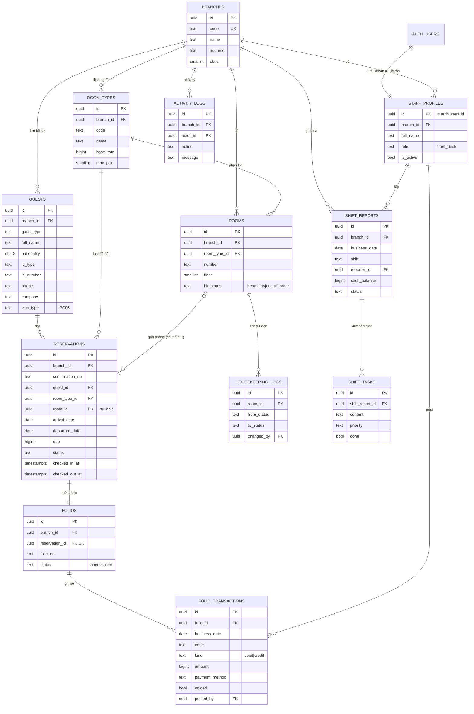

# Avanti OS — ERD (Supabase)

Schema đầy đủ: [`supabase/migrations/0001_init.sql`](../supabase/migrations/0001_init.sql). API nghiệp vụ: [`0002_rpc.sql`](../supabase/migrations/0002_rpc.sql), mô tả ở [api.md](api.md). Lịch sử sửa hồ sơ khách: bảng `guest_changes` ghi bằng trigger trong [`0003_guest_changes.sql`](../supabase/migrations/0003_guest_changes.sql).
Kiểu dữ liệu frontend tương ứng: [`lib/pms/types.ts`](../lib/pms/types.ts) (camelCase ↔ snake_case).



## Quy tắc nghiệp vụ nằm ở database

| Quy tắc | Cách đảm bảo |
|---|---|
| Không đặt trùng phòng trùng ngày | `exclude using gist (room_id, daterange)` cho trạng thái tentative/confirmed/checked_in |
| Mỗi đặt phòng có đúng 1 folio | `folios.reservation_id unique` |
| Giao dịch không bị xóa / sửa tiền | Không có policy update/delete; hủy bằng RPC `void_transaction` (lưu vết) |
| Check-in chỉ vào phòng sạch, tự post tiền phòng + VAT từng đêm | RPC `check_in` |
| Check-out khi số dư folio = 0, phòng chuyển "chờ dọn" | RPC `check_out` + view `folio_balances` |
| Lễ tân chỉ thấy dữ liệu chi nhánh mình | RLS theo `private.current_branch_id()` |

## Trạng thái đặt phòng

```
tentative ─┐
           ├─► confirmed ─► checked_in ─► checked_out
           └─► cancelled          └─(quá ngày)─► no_show
```
Trạng thái phòng hiển thị = `occupied` nếu có đặt phòng `checked_in`, ngược lại là `rooms.hk_status`.
